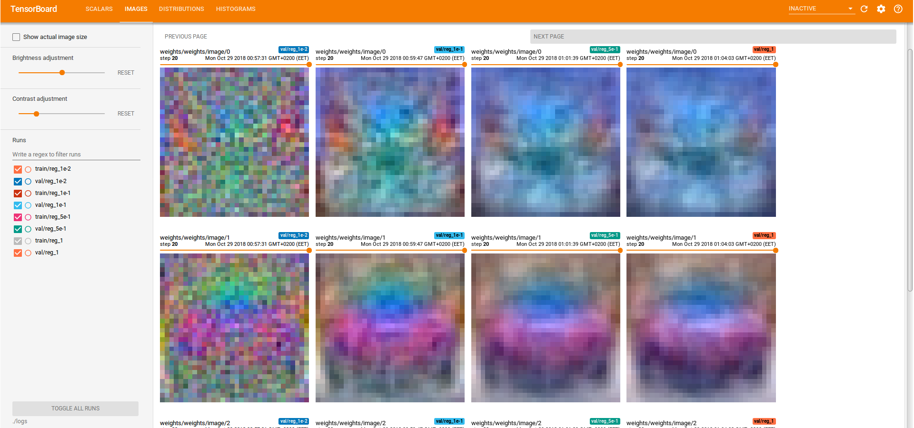
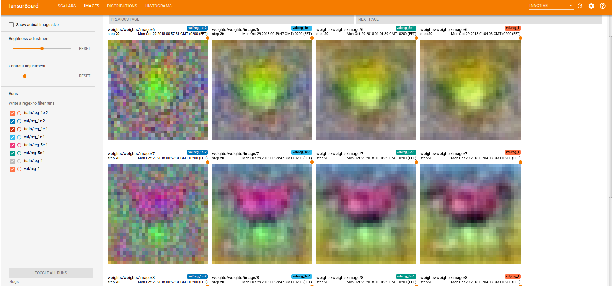
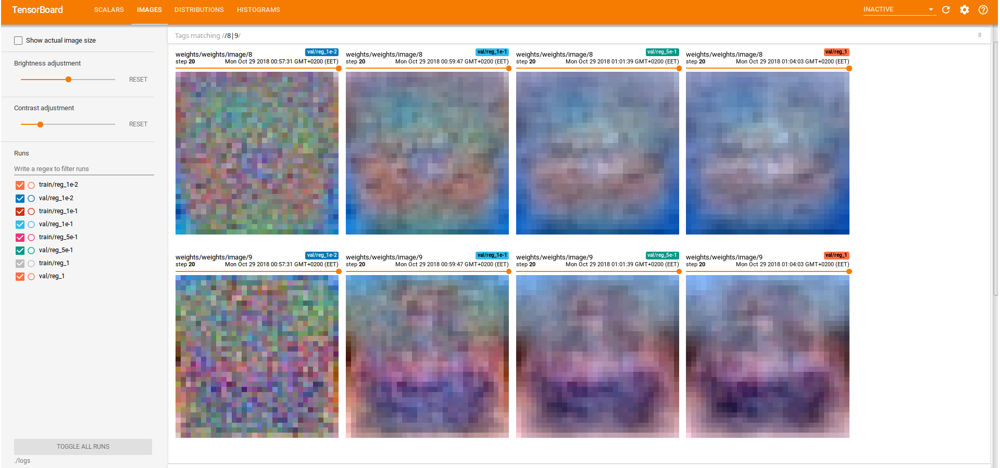
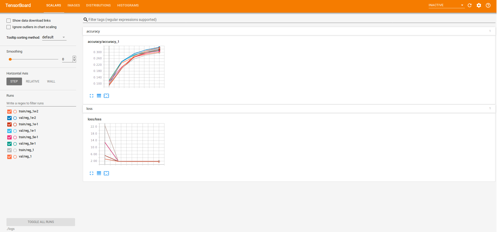
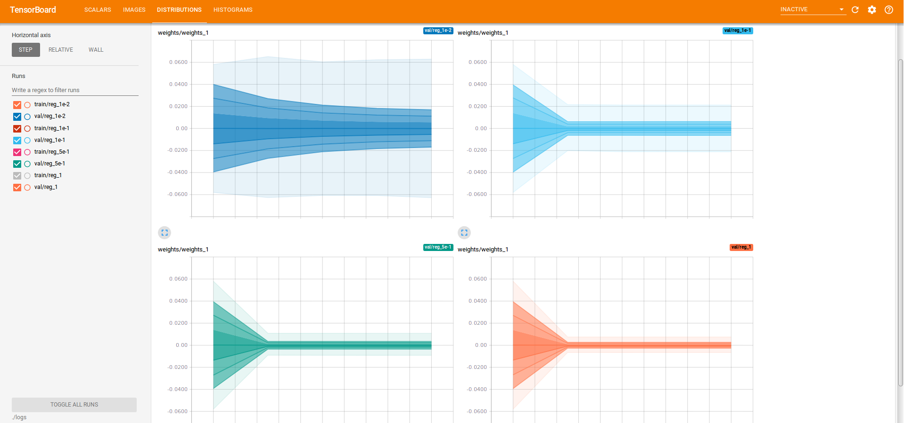
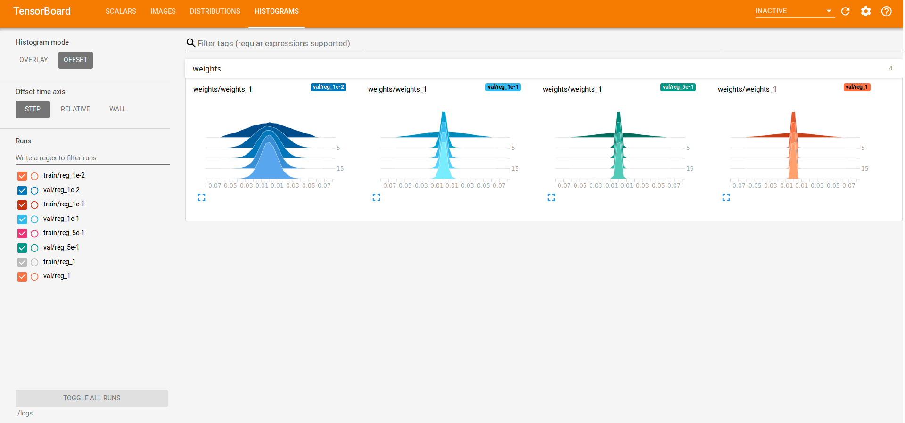

# Softmax classifier for CIFAR-10
## Visualizing learning with TensorBoard
`$ tensorboard --logdir=./logs`

### Visualize the learned weights for some classes
The weights look better if the regularization loss is added.
  
  

### Accuracy and Loss

### Weights distributions

### Weights histograms

